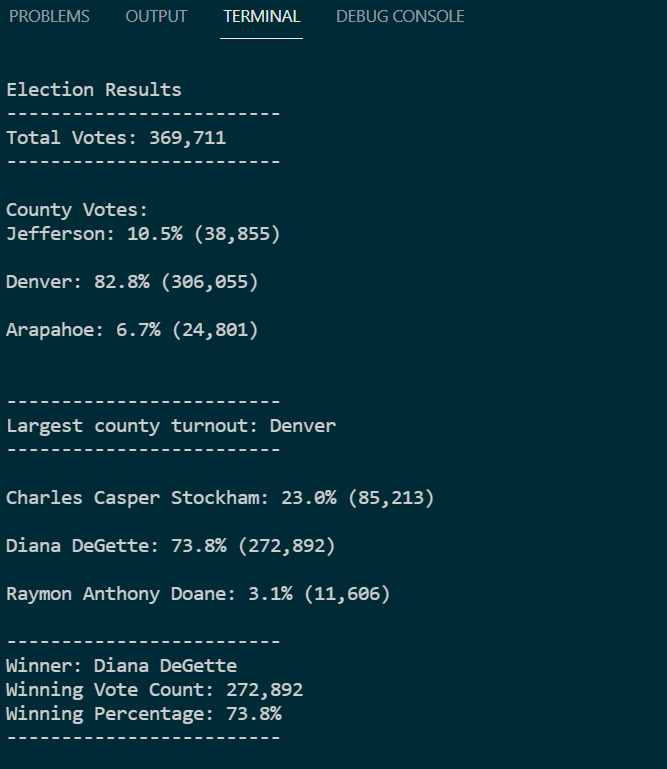

# Election Analysis Using Python

## Overview of Election Audit
A Colorado Board of Elections employee, needs assistance with an elections audit for the U.S. Congressional Precinct in Colorado. A [csv file](resources/election_results.csv) containing votes by ballot ID, with county and selected candidate was provided. The process has been automated via Python, and produces a [txt file](analysis/election_analysis.txt) with a report of the results.

## Election-Audit Results

- There were a total of 369,711 votes in this election.
- The results, per precinct were:
    - Jefferson: 10.5% (38,855 votes)
    - Denver: 82.8% (306,055 votes)
    - Arapahoe: 6.7% (24,801 votes)
- **Denver** had the largest voting turnout.
- The candidate results were as follows:
    - Charles Casper Stockham: 23.0% (85,213 total votes)
    - Diana DeGette: 73.8% (272,892 total votes)
    - Raymon Anthony Doane: 3.1% (11,606 total votes)
- The winner of this election was **Diana DeGette**, with 272,892 votes, which represent **73.8%** of the electorate.

Here is a screenshot of the results, as they are displayed on a terminal.


## Election-Audit Summary
The [python script](PyPoll_Challenge.py) can be repurposed for other elections with few modifications:
- A prompt box can be added to enable the user to select the file name by replacing line 9 with the following: 
```
file_name = input('File name of csv document:')
file_name = file_name + ".csv"
file_to_load = os.path.join("resources", file_name)
```
- In addition to reading from a .csv file, the code can be repurposed to read from other file formats, such as .txt, xlsx, or .json by importing a different library, such as `pandas`, and requesting the file type in a similar way as demonstrated above. Additional modifications would be needed to use the pandas methods for these file types. [This blog](https://www.analyticsvidhya.com/blog/2017/03/read-commonly-used-formats-using-python/) provides more information on these methods.
